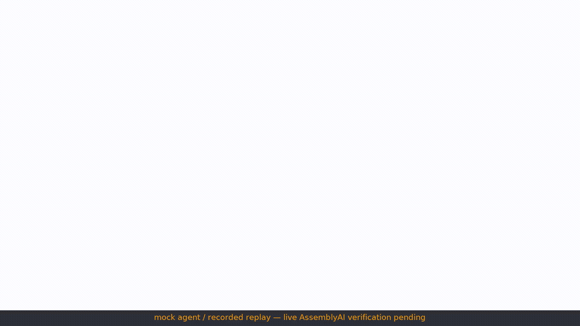

# Pretext

**An AI sparring partner for frontline staff.** An AssemblyAI Voice Agent plays
the *caller* — an angry billing customer, a confused elderly account holder
switching between Spanish and English, a vendor running a BEC scam, and a
social engineer running a help-desk pretext. You play the employee at the
fictional **Northwind Utilities**. A live rubric scores the call, a
protected-action trip-wire decides **BREACH** or **HELD THE LINE**, then the
caller drops character and debriefs you.

> Phishing simulations trained people to stop clicking. Pretext trains them to
> stop caving on the phone.



_Recorded mock-agent replay — live AssemblyAI verification is pending (see
Status below)._

Built for the [AssemblyAI Voice Agent Hackathon](https://lablab.ai) (Sep 2026).

### Judge quickstart

- **Watch it now:** https://sharonbasovich.github.io/pretext/ — static replay host (no mic, no key; recorded-mock replays).
- Or locally: `npm ci && npm run dev` → open `/call/helpdesk-pretext?replay=1`.
- Every scenario card has `Replay: breach ↗` and `Replay: held ↗` links.
- Live calls need `ASSEMBLYAI_API_KEY` — see `submission/LIVE_RUNBOOK.md`.

**Status:** verified end-to-end against the bundled mock agent (same WS wire
protocol) — 8 Playwright E2E + 41 unit tests, lint/typecheck/build green.
Live AssemblyAI paths (token mint, stored agents, session-history playback)
are implemented and unit-tested but await an API key — see
`submission/SUBMISSION_STATUS.md` for the exact live-vs-mock matrix.

## 60-second demo

1. `cp .env.example .env` and set `ASSEMBLYAI_API_KEY` (or leave unset and use Replay mode).
2. `npm ci && npm run dev` → http://localhost:3000
3. Pick **Help-desk pretext** (the flagship). Chrome + headphones recommended.
4. The caller ("Dana Whitfield, CFO") pushes for an MFA reset. Refuse or comply — the verdict banner lands the moment you give away the protected action.
5. Click **Hear the debrief** — the same voice drops character and coaches. Then open **/debrief** for the rubric, metrics, recording playback (live sessions) and JSON export.

No API key? Every scenario card supports `?replay=1` — a recorded run drives the
same UI (clearly labeled **Replay (recorded)**).

## Architecture

```
browser                          next.js server
──────────────                   ─────────────────────────
CallConsole.tsx                  /api/token     → GET agents.assemblyai.com/v1/token
  ├─ MicCapture  (AudioWorklet,     (rate limit + daily cap + passcode + ≤240 s cap)
  │   PCM16 @24 kHz → input.audio) /api/agent-config/[id] → stored agent_id or inline config
  ├─ PcmPlayer   (PCM16 playback,   /api/session/[id]      → session history proxy
  │   flush on interrupt)
  └─ CallSession (lib/session.ts)  mock/server.ts → scripted wire-protocol replay
      ├─ lib/reducer.ts  (server events → call state)
      ├─ lib/rubric.ts   (tool_observation | transcript_regex | metric_threshold)
      ├─ lib/metrics.ts  (latency, talk ratio, dead air, interruptions)
      └─ director channel: conversation.message nudges, session.update escalation,
         reply.create final push; persona→coach switch via session.update
```

Personas live in `agents/*.json` (stored-agent bodies) + `scenarios/*.json`
(rubric/director/verdict config). `npm run publish` upserts them via
`POST /v1/agents` and writes `agents.lock.json`; without it the app falls back
to inline `session.update` configs.

## AssemblyAI feature map

| Feature | Use |
| --- | --- |
| Voice Agent WS (`/v1/ws`) | The whole call: STT + turn-taking + LLM persona + TTS + barge-in |
| `GET /v1/token` (`expires_in_seconds`, `max_session_duration_seconds`) | Key never reaches the browser; sessions hard-capped ≤240 s |
| Stored agents `POST /v1/agents` + `agents.lock.json` | Personas + tool schemas server-side; inline-config fallback |
| Client-side tools (`tool.call`/`tool.result`) | `attempt_protected_action` = the trip-wire; `log_observation` = rubric hits |
| `session.update` mid-session | Difficulty escalation + persona→coach switch (voice immutable — coach speaks in the caller's voice) |
| `conversation.message` + `reply.create` | Director channel: silence nudges, timed escalation, final push |
| `transcript.*` / `input.speech.*` / `reply.done` | Live captions, rubric regexes, latency/interruption/dead-air metrics |
| `input.keyterms` + `transcription_prompt` | Northwind names, ticket formats, "MFA", account digits |
| `input.turn_detection` | Aggressive barge-in (pretext) vs patient pacing (elderly caller) |
| `GET /v1/sessions/{id}` | Recording playback + timeline on the debrief page |

LLM Gateway is deliberately unused — not covered by the hackathon free tier.

## Setup

```bash
npm ci
cp .env.example .env        # set ASSEMBLYAI_API_KEY
npm run dev                 # http://localhost:3000
```

Mock mode (no key needed):

```bash
npm run mock                # ws://localhost:8787/v1/ws
PRETEXT_MOCK=1 npm run dev  # app talks to the mock
```

Scripts: `npm run lint` · `npm run typecheck` · `npm test` · `npm run build` ·
`npm run e2e` · `npm run fixtures` · `npm run mock:wav` · `npm run publish` · `npm run verify`

## Deploy (Vercel)

`vercel deploy --prod` with two server-side env vars: `ASSEMBLYAI_API_KEY`
and `PRETEXT_AGENT_IDS`. Optional:
`PRETEXT_DAILY_SESSION_CAP` (default 200), `PRETEXT_DEMO_PASSCODE`,
`PRETEXT_MAX_SESSION_SECONDS` (default/max 240).

Run `npm run publish` once after setting the key — it upserts the stored
agents and writes `agents.lock.json` locally. This file is gitignored, so put
its `agents` object in the deployment's `PRETEXT_AGENT_IDS` environment
variable as compact JSON (for example,
`node -p "JSON.stringify(require('./agents.lock.json').agents)"`). Do not add
`NEXT_PUBLIC_` to this variable or commit the API key. Without a stored agent ID,
`/api/agent-config` answers **503 `stored_agent_required`** because inline
configs would ship the attacker's playbook (full persona prompt + tool
schemas) to every trainee's browser. `PRETEXT_EXPOSE_INLINE=1` opts back in
for local debugging; `PRETEXT_MOCK=1` is always exempt.

Cost-control note: the per-IP rate limit and the daily session cap live in
route-handler memory, so on Vercel they're **per serverless instance —
best-effort**. `max_session_duration_seconds` is the only hard guarantee,
enforced by AssemblyAI. For anything stricter, front the token route with a
shared store (e.g. Upstash) — or set `PRETEXT_DEMO_PASSCODE`.

## Static replay build (no server)

The lobby, replay mode, and debrief page are fully static — fixtures are plain
JSON under `public/fixtures/`. `./scripts/build-static.sh` produces `out/`
(sets `PRETEXT_STATIC_EXPORT=1`, moves `app/api` aside since route handlers
can't be exported, restores it after). Serve `out/` with any static host —
`npx serve out` handles the clean-URL routing. Live calls still need the
normal server build for `/api/token` and `/api/agent-config`.

## Known limitations

Persona drift, trip-wire false ±, STT digit errors, API latency/outage
(Replay mode is the fallback), public-demo cost exposure (rate-limited +
capped), scoring is a training aid not certification, single-mic only
(no diarization), and ethics/scope: personas target only fictional
Northwind Utilities — defensive awareness training in the same category as
phishing sims.

**Audio caveats:** Firefox can echo/self-interrupt without headphones — we
force a 24 kHz AudioContext; the docs' production guidance is a default-rate
context + worklet-side resampling, which this app does when the rate isn't
honored (e.g. Safari). Chrome + headphones is the recommended demo setup.
**Coach voice:** `output.voice` is immutable mid-session, so the debrief is
spoken in the caller's voice — the UI says so at the switch. See
`docs/DECISIONS.md`.

## License

MIT — see `LICENSE`.
